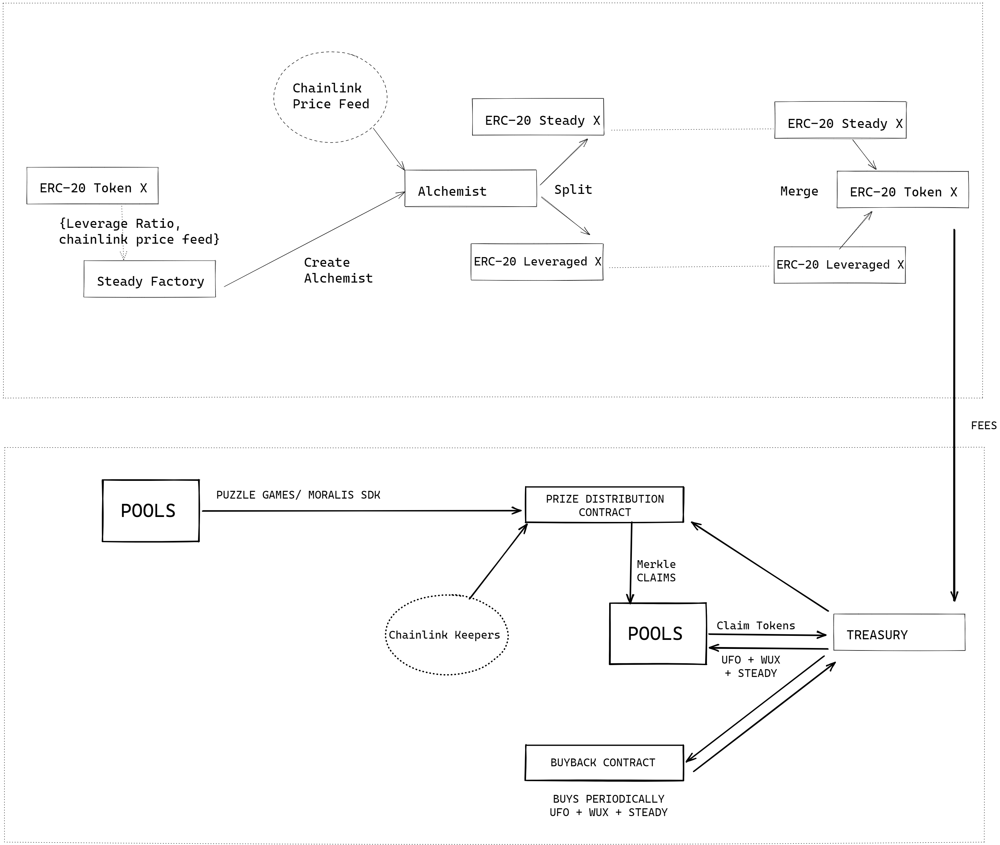

# Steady DAO - Chainlink Hackathon 2021


# Basics

<p align="center">
  
</p>


At the base a contract that splits a token based on the latest chainlink price into 2 tokens, one token will be the same as the original token and will hold all of its properties.

Another is based on the current USD value of that token.

The equation that we use is 
if K denotes the original token amount, 
let X denote the Steady token,
Y the Unsteady token and if the ratio of M:N = 1:2 then
      
 price = max(1, priceFromOracle());
 X = K * .75 * uint(price)
 Y = K * .25

Anyone is free to create their base metals from their own CHYME (ALLOY). Upon splitting we intend to give the users Steady DAO and UFO tokens from the treasury.
Upon merge a fee is deducted from the user, this fee is used to buy UFO tokens and Steady DAO tokens from the market to give out during splitting.

Unfortunately, we were not able to integrate the tokenomics into the contracts.

## How we used moralis

We managed to integrate moralis into gamemaker studio 2 which we think is a huge boon to the indie dev community. We use moralis to create a database for contract events and to trigger in game actions based on this.

## How we used chainlink keepers

We utilized chainlink keepers to do a prize distribution across pools, or across DAO's. The keepers in every epoch calls our Merkle Distributor contract
and stores the merkle hash for that epoch.

### Deployed Addresses
#### Keeper
https://keepers-ui-git-feature-sc-17456add-mumbai-1d47f8-chainlinklabs.vercel.app/mumbai/141

#### Upkeep contract
This runs every epoch and calls the api contract(Right now we used a dummy api contract)

https://mumbai.polygonscan.com/address/0xfD68a78c1d259A2E2012F26e764f0A780d51F125#code

## How we used chainlink api oracle
We used chainlink oracle to get the latest merkle hash that must be pushed into the Merkle Distributor contract.

# Deploying 
This alchemist requires the address of the base token and the chainlink oracle for deployment. This is a factory contract, use npx hardhat run scripts/deploy.ts followed by custom.ts


# Testing 
```
npx hardhat test
```

## Coverage
We had added coverage, but during the hackathon this is broken.

```
npx hardhat coverage
```
